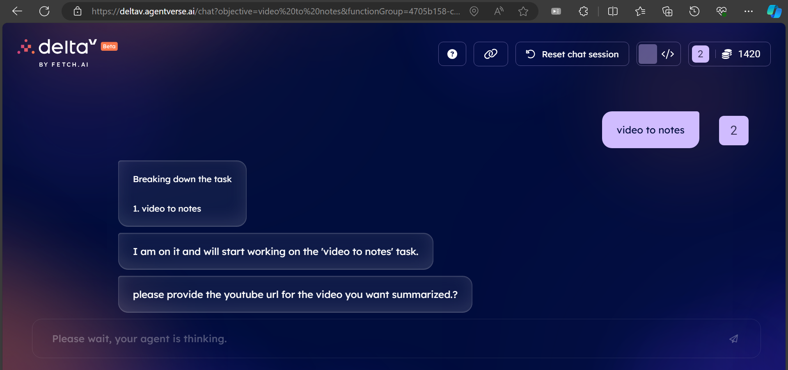
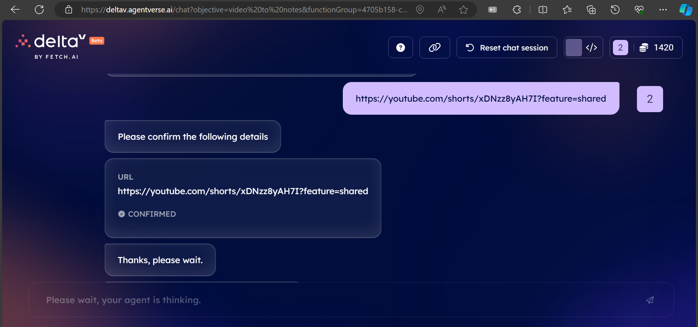
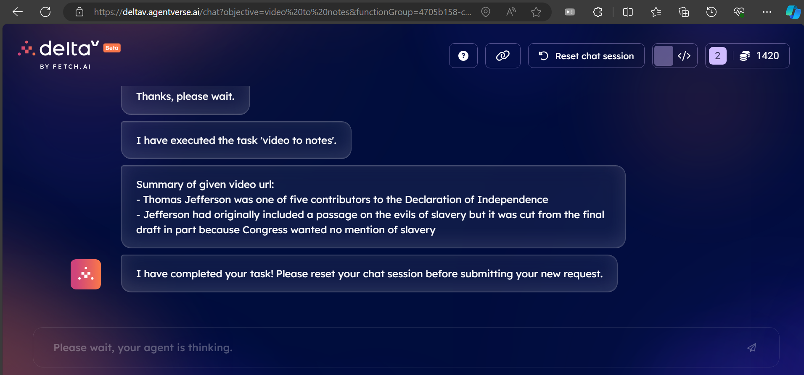

# Whimsee: Video to Notes Converter

Whimsee is a handy tool that converts video content into summarized notes. With Whimsee, you can quickly obtain concise notes from any YouTube video, making it easier to grasp the key points without having to watch the entire video.

## Features

- **Efficient Summarization**: Utilizes advanced summarization techniques to condense lengthy transcripts into bullet-pointed notes.
- **YouTube Video Support**: Works seamlessly with YouTube video URLs, extracting transcripts directly from the provided links.
- **Chunked Processing**: Divides the transcript into manageable chunks for efficient summarization, ensuring accurate and concise notes.
- **Error Handling**: Provides informative error messages in case of invalid URLs or transcript retrieval failures, guiding users to rectify the issue.

## Usage

## Steps to use this Integration on deltaV.

- Open `terminal` on your local machine and save the script as `whimsee.py`.
- Run the python script to get the `agent's address` and create a mailbox on agentverse.
- Get the Mailbox key and paste it in the code.
- Setup `function` in Agentverse to access DeltaV.
- In deltaV, query "video to notes".
- Send the YouTube URL when asked.
- You'll get the summarized output now.

## Dependencies

Whimsee relies on the following Python libraries:

- `ai_engine`
- `uagents`
- `youtube_transcript_api`
- `transformers`

## Expected output

## Contributing

If you encounter any issues or have suggestions for improvement, feel free to report them to me at [here](mailto:23f2004375@ds.study.iitm.ac.in).

---

For more information or support, contact [Whimsee Support](mailto:23f2004375@ds.study.iitm.ac.in).
